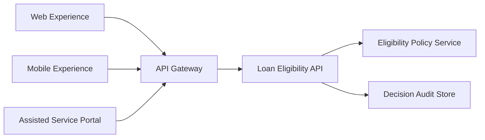
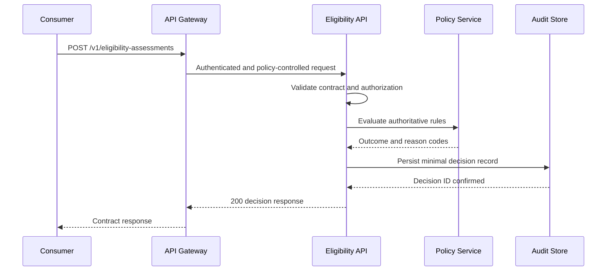

# Filled Design Contract Example: Retail Loan Eligibility API

> **Example status:** Illustrative and synthetic. This example demonstrates how to complete a design contract under **Principle 2: Design Contracts Before Consumers**. Names, systems, service levels, identifiers, and policy values are fictional and must not be treated as organisational standards or production configuration.

---

## 1. Document Control

| Attribute | Value |
|---|---|
| Contract title | Retail Loan Eligibility API Contract |
| Contract identifier | LENDING-ELIGIBILITY-API-001 |
| Capability or domain | Retail Lending / Credit Eligibility |
| Interface type | Synchronous REST API |
| Specification format | OpenAPI 3.1 and JSON Schema 2020-12 |
| Contract version | 1.0.0 |
| Lifecycle state | Draft for review |
| Exposure classification | Internal, service-to-service |
| Information classification | Confidential, contains personal and financial information |
| Business owner | Head of Retail Lending, fictional role |
| Product/service owner | Product Owner, Lending Decision Services |
| Technical owner | Engineering Lead, Lending Decision Services |
| Security reviewer | Application Security Lead |
| Operations owner | Lending Platform Operations |
| Repository location | `contracts/retail-lending/loan-eligibility/` |
| Machine-readable specification | `openapi/loan-eligibility-v1.yaml` |
| Service catalogue entry | `SVC-LENDING-ELIGIBILITY` |
| Effective date | To be assigned following approval |
| Next review date | Twelve months after approval or upon material change |
| Supersedes | Not applicable, initial version |

### 1.1 Revision History

| Version | Date | Author | Change summary | Compatibility impact |
|---|---|---|---|---|
| 0.1 | 2026-09-28 | Solution Architecture | Initial illustrative draft | None |
| 0.2 | To be assigned | API design working group | Consumer and security review updates | To be assessed |
| 1.0.0 | To be assigned | Contract owner | First approved publication | Initial baseline |

### 1.2 Review and Approval

| Review area | Reviewer or authority | Required? | Decision | Conditions |
|---|---|---:|---|---|
| Business/domain | Retail Lending Domain Owner | Yes | Pending | Eligibility semantics must be confirmed |
| Consumer representative | Digital Lending Product Owner | Yes | Pending | Mock API required before frontend build |
| Architecture | Architecture Review Authority | Yes | Pending | No channel-specific logic in core service |
| Security | Application Security | Yes | Pending | Threat model and authorization tests required |
| Privacy | Privacy Office | Yes | Pending | Data-minimisation review required |
| Data governance | Lending Data Owner | Yes | Pending | Source-of-truth fields must be approved |
| Operations | Lending Platform Operations | Yes | Pending | Alerts and runbooks required before production |

---

## 2. Executive Summary

### 2.1 Contract Intent

The Retail Loan Eligibility API determines whether an applicant is eligible to proceed to a retail personal-loan application. It provides a consistent, channel-neutral decision for web, mobile, assisted-service, and approved partner experiences.

The API performs an eligibility assessment only. It does not issue credit, calculate a final interest rate, create a loan account, or replace formal credit assessment and approval.

### 2.2 In Scope

- Validate the minimum information required for an eligibility assessment.
- Apply authoritative eligibility rules maintained by the lending domain.
- Return `ELIGIBLE`, `INELIGIBLE`, or `REFER` as the business outcome.
- Return stable reason codes suitable for machine processing.
- Create an auditable decision record using a non-sensitive decision identifier.
- Support idempotent resubmission of the same assessment request.

### 2.3 Out of Scope

- User-interface validation and presentation.
- Customer identity proofing.
- Final credit risk assessment or loan approval.
- Pricing and interest-rate calculation.
- Account creation, settlement, or funds disbursement.
- Direct access to credit-bureau or income-verification data by consumers.
- Storage of a complete application by the eligibility service.

### 2.4 Key Decisions

1. The contract expresses the business action `assess eligibility`, not a screen action such as `submit form`.
2. The authoritative decision is server-side. Client-side checks are advisory only.
3. Consumers receive stable reason codes, while customer-facing wording remains a channel responsibility.
4. The API returns `REFER` when automated assessment cannot safely produce a final eligibility outcome.
5. Detailed policy thresholds are implementation-controlled and are not exposed in the public contract.

### 2.5 Contract-First Readiness

| Criterion | Status | Evidence/action |
|---|---|---|
| Business semantics agreed | Amber | Domain workshop required |
| Machine-readable specification | Green | Skeleton included in Appendix A |
| Examples and errors defined | Green | Sections 6 and 10 |
| Security requirements agreed | Amber | Threat-model approval pending |
| Compatibility policy defined | Green | Section 14 |
| Mock available | Amber | Generate from approved OpenAPI draft |
| Contract tests defined | Green | Section 15 |
| Operational expectations defined | Amber | Final dashboard thresholds pending |

---

## 3. Business and Domain Context

### 3.1 Business Capability

- **Capability:** Assess retail loan eligibility
- **Domain:** Retail Lending
- **Business purpose:** Provide a consistent preliminary eligibility decision before a customer starts a full application
- **Authoritative owner:** Retail Lending Domain Owner
- **Criticality:** High, because the outcome affects access to a lending journey and must be consistent, explainable, secure, and auditable

### 3.2 Business Outcomes

| Outcome | Measure | Illustrative target | Owner |
|---|---|---|---|
| Consistent decisions across channels | Same input produces same decision version and outcome | 100% in contract tests | Domain Owner |
| Reduced duplicated business logic | Channels using authoritative service | All approved channels | Product Owner |
| Faster consumer onboarding | Mock and specification available before implementation | Required at Definition of Ready | API Owner |
| Traceable decisions | Decisions linked to policy and ruleset version | 100% | Operations Owner |

### 3.3 Authoritative Business Rules

> The values below are fictional examples. Production thresholds must be held in approved policy configuration and governed separately.

| Rule ID | Rule statement | Source/authority | Enforced by | Consumer visibility |
|---|---|---|---|---|
| ELG-001 | Applicant must meet the approved minimum age | Lending Eligibility Policy | Eligibility domain service | `MINIMUM_AGE_NOT_MET` |
| ELG-002 | Applicant must have an accepted residency status | Lending Eligibility Policy | Eligibility domain service | `RESIDENCY_NOT_SUPPORTED` |
| ELG-003 | Requested amount must be within the supported product range | Product Policy | Eligibility domain service | `AMOUNT_OUTSIDE_PRODUCT_RANGE` |
| ELG-004 | Applicant income and declared commitments must be sufficient for preliminary servicing rules | Responsible Lending Policy | Eligibility domain service | `PRELIMINARY_SERVICEABILITY_NOT_MET` |
| ELG-005 | Insufficient or conflicting information must result in referral, not an inferred approval | Lending Decision Standard | Eligibility domain service | `MANUAL_REVIEW_REQUIRED` |

### 3.4 Glossary

| Term | Definition |
|---|---|
| Eligibility assessment | Preliminary evaluation of whether an applicant may proceed to a full application |
| Eligible | Applicant satisfies the configured preliminary eligibility rules |
| Ineligible | At least one deterministic rule prevents progression |
| Refer | Automated processing cannot safely or conclusively determine eligibility |
| Decision ID | Opaque identifier for an eligibility decision record |
| Ruleset version | Identifier for the approved policy configuration used during assessment |
| Consumer | Approved channel or service invoking the API |

### 3.5 Assumptions and Constraints

- The consumer has authenticated the user and has an approved purpose for submitting the data.
- The API does not trust client-side calculations or eligibility outcomes.
- The consumer does not send names, addresses, identity-document images, or free-text notes.
- Monetary values use decimal amounts and ISO 4217 currency codes.
- The provider may use approved internal dependencies without exposing their implementation details.

---

## 4. Stakeholders, Ownership, and Consumers

### 4.1 Responsibility Model

| Responsibility | Accountable | Responsible | Consulted |
|---|---|---|---|
| Business semantics | Retail Lending Domain Owner | Lending Policy Team | Consumer product owners |
| Contract design | Technical Owner | API Design Team | Architecture and consumers |
| Security/privacy | Security and Privacy Reviewers | Engineering Team | Data Owner |
| Implementation | Technical Owner | Lending Decision Engineering | Platform Engineering |
| Contract testing | Technical Owner | Provider and consumer teams | Quality Engineering |
| Publication | Product Owner | API Platform Team | Architecture |
| Operations | Operations Owner | Lending Platform Operations | Engineering |
| Versioning and retirement | Product Owner | API Owner | Known consumers |

### 4.2 Consumer Inventory

| Consumer | Use case | Criticality | Release cadence | Contract version |
|---|---|---|---|---|
| Digital Web Lending | Public web pre-eligibility journey | High | Independent | v1 |
| Mobile Lending | Authenticated mobile journey | High | Independent | v1 |
| Assisted Service Portal | Staff-assisted eligibility assessment | High | Independent | v1 |
| Partner Gateway | Approved partner-originated referrals | Medium | Independent | v1 after separate onboarding |

### 4.3 Consumer Obligations

Consumers MUST:

- Use only documented fields, values, errors, and behaviour.
- Obtain required user authority and provide required transaction context.
- Never calculate or display an authoritative eligibility outcome before receiving the API decision.
- Handle all three outcomes: `ELIGIBLE`, `INELIGIBLE`, and `REFER`.
- Treat reason codes as machine-readable values and map them to approved channel wording.
- Protect tokens and response data and avoid logging complete request payloads.
- Respect rate limits, timeouts, and bounded retry guidance.
- Submit an idempotency key for each logical assessment request.
- Migrate from deprecated versions within the agreed support window.

### 4.4 Provider Obligations

The provider MUST:

- Enforce all authoritative rules and validation server-side.
- Return the ruleset version used for every successful business decision.
- Preserve documented semantics within a major version.
- Produce stable, non-sensitive error and reason codes.
- Prevent direct consumer access to internal policy engines and data stores.
- Maintain auditability, monitoring, support, and lifecycle documentation.

---

## 5. Contract Overview

### 5.1 Interaction Style

- **Pattern:** Synchronous request-response
- **Protocol:** HTTPS with approved TLS configuration
- **Payload:** JSON encoded as UTF-8
- **Specification:** OpenAPI 3.1
- **Consistency:** A decision is internally consistent with the ruleset version returned in the response
- **State:** The service stores a minimal decision record but not the complete loan application

### 5.2 Logical Context



### 5.3 Interaction Sequence



### 5.4 Interface Inventory

| Interface ID | Name | Type | Purpose |
|---|---|---|---|
| INT-001 | Create Eligibility Assessment | POST API | Produce a preliminary eligibility decision |
| INT-002 | Retrieve Eligibility Assessment | GET API | Retrieve a previously created decision by ID |
| INT-003 | Health and readiness | Platform endpoint | Operational use only; not a business interface |

---

## 6. Synchronous API Contract

### 6.1 Service Metadata

| Item | Definition |
|---|---|
| API title | Retail Loan Eligibility API |
| Base path | `/retail-lending/eligibility` |
| API version | v1 |
| Media type | `application/json` |
| Date/time | RFC 3339-compatible UTC timestamps |
| Identifier | Opaque UUID-formatted values; consumers must not infer meaning |
| Currency | ISO 4217 code plus decimal amount represented as a JSON string |

### 6.2 Resource and Operation Catalogue

| Operation ID | Method | Path | Business intent | Authorization | Idempotent? |
|---|---|---|---|---|---:|
| `createEligibilityAssessment` | POST | `/v1/eligibility-assessments` | Assess preliminary eligibility | `eligibility.assess` | Yes, with key |
| `getEligibilityAssessment` | GET | `/v1/eligibility-assessments/{decisionId}` | Retrieve a decision | `eligibility.read` plus resource policy | Yes |

### 6.3 Create Eligibility Assessment

#### Request Headers

| Header | Required? | Meaning | Constraints |
|---|---:|---|---|
| `Authorization` | Yes | OAuth access token | Correct issuer, audience, expiry, and scope |
| `Idempotency-Key` | Yes | Identifies one logical assessment | UUID, retained for 24 hours in this example |
| `X-Correlation-ID` | No | Consumer correlation identifier | UUID if supplied; provider generates otherwise |
| `Content-Type` | Yes | Request media type | `application/json` |

#### Request Fields

| Field | Type | Required? | Constraints | Meaning | Classification |
|---|---|---:|---|---|---|
| `applicantReference` | String | Yes | Opaque, 1 to 64 chars | Consumer-scoped applicant reference | Confidential |
| `dateOfBirth` | String/date | Yes | Valid past date | Used for age rule | Personal |
| `residencyStatus` | String | Yes | Enum | Declared residency category | Personal |
| `annualGrossIncome.amount` | String/decimal | Yes | Non-negative, 2 decimals | Declared annual gross income | Financial |
| `annualGrossIncome.currency` | String | Yes | `AUD` in v1 | Currency | Internal |
| `monthlyCommitments.amount` | String/decimal | Yes | Non-negative, 2 decimals | Declared monthly commitments | Financial |
| `monthlyCommitments.currency` | String | Yes | Same as income | Currency | Internal |
| `requestedAmount.amount` | String/decimal | Yes | Positive, 2 decimals | Requested principal | Financial |
| `requestedAmount.currency` | String | Yes | `AUD` in v1 | Currency | Internal |
| `employmentStatus` | String | Yes | Enum | Declared employment category | Personal |
| `channelContext` | String | Yes | Approved enum | Legitimate audit and channel context | Internal |

#### Valid Request Example

```json
{
  "applicantReference": "WEB-APPLICANT-8f61c0",
  "dateOfBirth": "1990-04-15",
  "residencyStatus": "PERMANENT_RESIDENT",
  "annualGrossIncome": {
    "amount": "95000.00",
    "currency": "AUD"
  },
  "monthlyCommitments": {
    "amount": "1250.00",
    "currency": "AUD"
  },
  "requestedAmount": {
    "amount": "25000.00",
    "currency": "AUD"
  },
  "employmentStatus": "EMPLOYED_FULL_TIME",
  "channelContext": "DIGITAL_WEB"
}
```

#### Successful Response

| Status | Meaning |
|---|---|
| 200 | Assessment completed and business outcome returned |

```json
{
  "decisionId": "471a16a2-fb98-4cba-9206-c3b72e1018e2",
  "applicantReference": "WEB-APPLICANT-8f61c0",
  "outcome": "ELIGIBLE",
  "reasonCodes": [],
  "rulesetVersion": "eligibility-policy-2026.09",
  "assessedAt": "2026-09-28T03:45:12Z",
  "expiresAt": "2026-10-05T03:45:12Z",
  "nextAction": "CONTINUE_TO_APPLICATION",
  "correlationId": "6c26a54e-c6fb-45dc-853c-a0662a2c88ee"
}
```

#### Ineligible Business Outcome

An ineligible decision is a successful business response, not a technical error.

```json
{
  "decisionId": "895afc83-f87b-4d2d-81d6-81669945c4e8",
  "applicantReference": "MOBILE-APPLICANT-93cc25",
  "outcome": "INELIGIBLE",
  "reasonCodes": [
    "AMOUNT_OUTSIDE_PRODUCT_RANGE"
  ],
  "rulesetVersion": "eligibility-policy-2026.09",
  "assessedAt": "2026-09-28T03:47:22Z",
  "expiresAt": "2026-10-05T03:47:22Z",
  "nextAction": "DO_NOT_CONTINUE",
  "correlationId": "06bd3d9f-49ae-4fec-bf88-eb2d5305e8f8"
}
```

#### Referral Outcome

```json
{
  "decisionId": "89209eaf-d78c-42e1-b105-78affc749080",
  "applicantReference": "PORTAL-APPLICANT-a1d8ef",
  "outcome": "REFER",
  "reasonCodes": [
    "MANUAL_REVIEW_REQUIRED"
  ],
  "rulesetVersion": "eligibility-policy-2026.09",
  "assessedAt": "2026-09-28T03:49:52Z",
  "expiresAt": "2026-10-05T03:49:52Z",
  "nextAction": "REFER_TO_LENDING_SPECIALIST",
  "correlationId": "ab652e06-0b2b-4389-bccc-aadc22dd608b"
}
```

### 6.4 Retrieve Eligibility Assessment

```http
GET /retail-lending/eligibility/v1/eligibility-assessments/{decisionId}
```

- The caller must be authorized for the decision's consumer context.
- The response uses the same decision schema as the POST response.
- `404` is returned when no visible resource exists for the caller.
- Retrieval does not rerun policy rules and does not extend expiry.

### 6.5 Idempotency

- A consumer must send one unique `Idempotency-Key` per logical assessment.
- Repeating a request with the same key and identical payload returns the original decision.
- Reusing the key with a materially different payload returns `409 IDEMPOTENCY_KEY_REUSED`.
- Consumers must not automatically generate a new key after an ambiguous timeout until they first retry using the original key.

### 6.6 Concurrency and Caching

- Eligibility decisions are immutable.
- Responses containing personal or financial data use `Cache-Control: no-store`.
- Consumers must not cache the request or decision in shared browser storage.
- Retrieval may return an `ETag`, but a decision cannot be updated through this API.

---

## 7. Data and Schema Definition

### 7.1 Core Enumerations

| Enumeration | Values | Unknown-value behaviour |
|---|---|---|
| `outcome` | `ELIGIBLE`, `INELIGIBLE`, `REFER` | Consumer must safely handle unknown values as referral and raise telemetry |
| `nextAction` | `CONTINUE_TO_APPLICATION`, `DO_NOT_CONTINUE`, `REFER_TO_LENDING_SPECIALIST` | Consumer must not infer an alternative action |
| `residencyStatus` | `CITIZEN`, `PERMANENT_RESIDENT`, `TEMPORARY_RESIDENT`, `OTHER` | Reject undocumented value |
| `employmentStatus` | `EMPLOYED_FULL_TIME`, `EMPLOYED_PART_TIME`, `SELF_EMPLOYED`, `CASUAL`, `NOT_EMPLOYED`, `OTHER` | Reject undocumented value |
| `channelContext` | `DIGITAL_WEB`, `MOBILE_APP`, `ASSISTED_SERVICE`, `APPROVED_PARTNER` | Reject undocumented value |

### 7.2 Null and Missing Semantics

- Required fields cannot be missing or `null`.
- Empty strings are invalid.
- `reasonCodes` is always present and is an empty array for an eligible decision.
- Optional fields omitted by the provider mean “not supplied by this contract version,” not zero or false.
- Consumers must not distinguish business meaning by JSON property order.

### 7.3 Monetary Representation

```json
{
  "amount": "25000.00",
  "currency": "AUD"
}
```

- Amount is a decimal string to prevent binary floating-point ambiguity.
- Currency is explicit.
- Rounding is performed only by authoritative domain logic.
- The consumer must not round, convert, or infer currency before submission.

### 7.4 Reason Codes

| Code | Outcome | Meaning | Consumer guidance |
|---|---|---|---|
| `MINIMUM_AGE_NOT_MET` | INELIGIBLE | Minimum age rule not met | Use approved neutral wording |
| `RESIDENCY_NOT_SUPPORTED` | INELIGIBLE | Residency category not supported | Do not reveal internal policy thresholds |
| `AMOUNT_OUTSIDE_PRODUCT_RANGE` | INELIGIBLE | Amount is outside supported range | Offer permitted alternate navigation only |
| `PRELIMINARY_SERVICEABILITY_NOT_MET` | INELIGIBLE | Preliminary servicing rule not met | Do not expose calculation internals |
| `MANUAL_REVIEW_REQUIRED` | REFER | Automated outcome unavailable or unsafe | Route to approved assisted process |

---

## 8. Security, Privacy, and Trust

### 8.1 Authentication

- OAuth 2.0 access token issued by the approved enterprise identity provider.
- The service validates issuer, audience, signature, expiry, and required scope.
- Workload credentials are held in an approved secrets or workload-identity platform.
- Browser clients do not call the domain service directly; they use an approved experience boundary.

### 8.2 Authorization

- `eligibility.assess` is required to create an assessment.
- `eligibility.read` is required to retrieve an assessment.
- Authorization is enforced at the resource and action boundary.
- A consumer may retrieve only decisions created within its approved consumer context unless explicitly authorized.
- Gateway authentication does not replace service-side authorization.

### 8.3 Data Minimisation

The contract intentionally excludes:

- Applicant name
- Residential address
- Government identifiers
- Identity-document images
- Bank-account details
- Free-text comments
- Credit-report contents

Only data required for the illustrative preliminary decision is accepted.

### 8.4 Input and Abuse Protection

- Reject unknown properties in request schemas.
- Enforce request-body size limits.
- Validate dates, decimal formats, enum values, and identifier length.
- Apply per-client and aggregate rate controls.
- Detect repeated enumeration and automated abuse patterns.
- Prevent replay through idempotency and token validation.
- Return safe errors without stack traces, SQL details, policy internals, or secrets.

### 8.5 Logging Restrictions

The following must not be logged in ordinary application logs:

- Complete request payloads
- Date of birth
- Income or commitments
- Access tokens
- Secrets or credentials
- Unmasked applicant references where not operationally necessary

Logs may contain approved decision IDs, correlation IDs, outcome category, ruleset version, duration, and non-sensitive error codes.

### 8.6 Retention and Deletion

- The minimal decision record has a retention period defined by the approved records and lending policy.
- Full request payloads are not retained by default in this example.
- Derived telemetry follows the same or stricter classification controls.
- Deletion, legal hold, and audit requirements are implemented by the data owner and records authority.

---

## 9. Error and Outcome Model

### 9.1 Error Envelope

```json
{
  "type": "urn:example:lending:error:validation",
  "title": "Request validation failed",
  "status": 400,
  "code": "INVALID_REQUEST",
  "detail": "One or more request fields are invalid.",
  "correlationId": "2a6b01d7-2aef-44d8-adf2-1e07afa2d132",
  "errors": [
    {
      "field": "requestedAmount.amount",
      "code": "INVALID_DECIMAL",
      "message": "The value must be a positive decimal amount with no more than two fractional digits."
    }
  ]
}
```

### 9.2 Error Catalogue

| HTTP status | Stable code | Meaning | Retriable? | Consumer action |
|---|---|---|---:|---|
| 400 | `INVALID_REQUEST` | Schema or validation failure | No | Correct request |
| 401 | `AUTHENTICATION_REQUIRED` | Token absent or invalid | No, until reauthenticated | Obtain valid token |
| 403 | `NOT_AUTHORIZED` | Caller lacks permission | No | Stop and follow access process |
| 404 | `DECISION_NOT_FOUND` | No visible decision exists | No | Do not enumerate IDs |
| 409 | `IDEMPOTENCY_KEY_REUSED` | Same key, different payload | No | Investigate consumer logic |
| 415 | `UNSUPPORTED_MEDIA_TYPE` | Media type unsupported | No | Send JSON |
| 429 | `RATE_LIMIT_EXCEEDED` | Quota exceeded | Yes, bounded | Honour `Retry-After` |
| 500 | `INTERNAL_ERROR` | Unexpected provider failure | Conditional | Retry once with same key after delay |
| 503 | `SERVICE_UNAVAILABLE` | Temporary unavailability | Yes, bounded | Retry with same key and backoff |
| 504 | `DEPENDENCY_TIMEOUT` | Provider dependency timed out | Conditional | Retry with same key after delay |

### 9.3 Business Outcomes Are Not Errors

- `INELIGIBLE` is returned using `200`, because the API successfully completed the requested assessment.
- `REFER` is returned using `200`, because it is a valid, governed business outcome.
- Consumers must not represent technical failure as ineligibility.
- Consumers must not represent a timeout as approval.

---

## 10. Service Quality and Capacity

> Values are illustrative and require approval through normal non-functional requirements governance.

| Indicator | Illustrative objective | Measurement point |
|---|---|---|
| Availability | 99.9% monthly, excluding approved maintenance | Provider edge |
| Latency | 95th percentile under 800 ms for assessment | Provider edge |
| Error rate | Less than 0.5% provider-attributable 5xx responses | Provider edge |
| Audit persistence | Decision record durable before success response | Domain service |
| Traceability | Correlation ID present for all invocations | End-to-end telemetry |

### 10.1 Limits

| Limit | Illustrative value | Exceed behaviour |
|---|---|---|
| Request body | 32 KB | 413 response |
| Rate limit | 60 assessments per minute per client | 429 with `Retry-After` |
| Concurrent requests | Defined per consumer during onboarding | Throttle, do not overload dependencies |
| Retrieval retention | Governed policy value | Decision becomes unavailable after policy period |

---

## 11. Resilience and Failure Behaviour

### 11.1 Timeout and Retry

- Consumer timeout: 3 seconds in this example.
- Provider dependency timeouts are shorter than the overall request budget.
- Consumers may perform one bounded retry for a transient failure using the original idempotency key.
- Retries use exponential backoff with jitter.
- Validation, authorization, and business outcomes are not retried automatically.

### 11.2 Failure Modes

| Failure mode | Contract behaviour | Consumer behaviour | Recovery |
|---|---|---|---|
| Policy service unavailable | 503 | Show temporary-unavailable state | Retry bounded; operations investigate |
| Audit store unavailable before commit | 503, no success | Do not display decision | Retry using same key |
| Response lost after commit | Retry returns original decision | Retry same key | Idempotency lookup |
| Unknown ruleset configuration | 500 or 503, no inferred decision | Do not progress | Configuration rollback |
| Capacity limit reached | 429 | Honour retry guidance | Scale or manage demand |
| Conflicting applicant data | `REFER` if defined by policy | Route to assisted process | Domain review |

### 11.3 Graceful Degradation

The service must not fabricate or default an eligibility decision when dependencies fail. The safe degraded behaviour is a clear temporary-unavailable state or governed referral outcome, depending on whether an authoritative assessment was completed.

---

## 12. Observability and Audit

### 12.1 Required Telemetry

| Signal | Required content |
|---|---|
| Logs | Timestamp, operation ID, correlation ID, decision ID when available, outcome category, ruleset version, duration, safe error code |
| Metrics | Request count, outcome count, 4xx and 5xx count, latency percentiles, throttling, dependency error rate |
| Traces | Gateway, eligibility service, policy service, audit-store spans with propagated trace context |
| Audit | Caller workload, decision ID, outcome, reason codes, ruleset version, timestamp, approved consumer context |

### 12.2 Alerts

| Condition | Illustrative trigger | Owner |
|---|---|---|
| High 5xx rate | Breach of approved error threshold | Lending Platform Operations |
| Latency degradation | Sustained SLO breach | Lending Platform Operations |
| Audit write failures | Any sustained failure preventing decisions | Operations and Engineering |
| Abnormal outcome shift | Material change from approved monitoring baseline | Domain Owner and Operations |
| Authorization failures | Suspicious or repeated pattern | Security Operations |

### 12.3 Audit Principles

- Audit records are tamper-protected and access-controlled.
- Business decision audit is distinct from verbose debug logging.
- The decision must identify the exact ruleset version used.
- Audit retrieval is restricted to authorized operational, risk, and assurance roles.

---

## 13. Compatibility, Versioning, and Lifecycle

### 13.1 Versioning Strategy

- Major contract version appears in the URL as `/v1`.
- The human-readable contract uses semantic versioning.
- Additive, backward-compatible changes increment the minor version.
- Clarifications that do not change behaviour increment the patch version.
- Breaking changes require a new major version and a consumer migration plan.

### 13.2 Compatible Changes

Examples generally considered compatible when consumers follow the contract:

- Add an optional response field.
- Add a new endpoint that does not change an existing endpoint.
- Add a new optional request field with defined default semantics.
- Improve description text without changing meaning.

### 13.3 Breaking Changes

The following require explicit impact assessment and usually a new major version:

- Remove or rename a field.
- Make an optional input required.
- Change a field type, format, cardinality, or meaning.
- Change the meaning of a reason code.
- Tighten validation so previously valid requests are rejected.
- Remove an outcome or change its next-action semantics.
- Change authentication, authorization, quotas, or availability commitments in a materially incompatible manner.

### 13.4 Enum Policy

Adding enum values may break consumers that use exhaustive parsing. Therefore:

- Consumers must implement a safe unknown-value path.
- The provider must consult known critical consumers before adding outcome or next-action values.
- New business outcomes require formal review even when syntactically additive.

### 13.5 Deprecation and Retirement

1. Publish replacement contract and migration guide.
2. Notify all registered consumers.
3. Maintain both versions for an approved transition period.
4. Track runtime usage by consumer.
5. Confirm contract tests pass on the target version.
6. Obtain retirement approval after usage reaches zero or approved exceptions are resolved.
7. Disable, monitor, and retire the deprecated version.

---

## 14. Testing and Assurance

### 14.1 Test Strategy

| Test type | Example coverage | Owner |
|---|---|---|
| Specification linting | OpenAPI syntax and organisational rules | API Owner |
| Schema validation | Every example validates | API Owner |
| Provider contract | Implementation matches status, headers, and schemas | Provider Team |
| Consumer-driven contract | Required fields and agreed semantics | Consumer Team |
| Rule tests | Each authoritative reason code and outcome | Domain and Provider Teams |
| Negative tests | Invalid types, missing fields, unauthorized calls | Provider Team |
| Compatibility tests | Compare proposed spec with published v1 | API Owner |
| Security tests | Authorization, injection, replay, enumeration, abuse | Security and Engineering |
| Performance tests | Approved workload and latency objectives | Performance Team |
| Resilience tests | Dependency timeout, duplicate request, lost response | Engineering and Operations |
| Privacy tests | Logging and telemetry contain no prohibited fields | Privacy and Engineering |

### 14.2 Representative Contract Tests

```gherkin
Feature: Retail loan eligibility contract

  Scenario: Eligible applicant receives an authoritative decision
    Given a valid authenticated consumer
    And a request that satisfies the configured eligibility rules
    When the consumer creates an eligibility assessment
    Then the response status is 200
    And outcome is ELIGIBLE
    And reasonCodes is empty
    And decisionId, rulesetVersion, assessedAt, and correlationId are present

  Scenario: Ineligibility is a successful business response
    Given a valid request outside the supported product amount range
    When the consumer creates an eligibility assessment
    Then the response status is 200
    And outcome is INELIGIBLE
    And reasonCodes contains AMOUNT_OUTSIDE_PRODUCT_RANGE

  Scenario: Duplicate request returns the original decision
    Given a completed assessment with an idempotency key
    When the identical request is repeated with the same key
    Then the original decisionId and decision are returned

  Scenario: Reusing a key with different content is rejected
    Given a completed assessment with an idempotency key
    When a materially different request uses the same key
    Then the response status is 409
    And code is IDEMPOTENCY_KEY_REUSED
```

### 14.3 Quality Gates

Production release is blocked unless:

- OpenAPI linting succeeds.
- Examples validate against schemas.
- Provider contract tests pass.
- Critical consumer contracts pass.
- Breaking-change detection passes or a new major version is approved.
- Security, privacy, performance, and resilience evidence is accepted.
- Catalogue, runbooks, dashboards, and support information are current.

---

## 15. Delivery and Publication

### 15.1 Repository Structure

```text
contracts/retail-lending/loan-eligibility/
  README.md
  openapi/
    loan-eligibility-v1.yaml
  schemas/
    money.schema.json
    error.schema.json
  examples/
    eligible-request.json
    eligible-response.json
    ineligible-response.json
    referral-response.json
    validation-error.json
  tests/
    provider/
    consumer/
    compatibility/
  migration/
  CHANGELOG.md
```

### 15.2 Contract Delivery Pipeline


### 15.3 Mock and Sandbox

- Generated from the reviewed OpenAPI specification.
- Supports eligible, ineligible, referral, validation-error, authorization-error, throttling, and temporary-unavailable scenarios.
- Contains only synthetic data.
- Does not claim to execute final policy logic.
- Is versioned with the contract.

---

## 16. Operations and Support

### 16.1 Support Model

| Area | Owner | Support route |
|---|---|---|
| Business semantics | Retail Lending Domain Owner | Domain support workflow |
| Integration support | API Owner | API support channel |
| Production incidents | Lending Platform Operations | Incident-management process |
| Security incidents | Security Operations | Security incident process |
| Privacy/data incidents | Privacy and Data Office | Privacy incident process |

### 16.2 Required Runbooks

- Provider unavailable
- Policy dependency unavailable
- Audit write failure
- Elevated latency or error rate
- Rate-limit adjustment
- Certificate or workload-identity rotation
- Decision reconciliation
- Consumer onboarding and credential revocation
- Rollback of ruleset configuration
- Major-version migration and retirement

---

## 17. Risks, Decisions, and Exceptions

### 17.1 Risk Register

| ID | Risk | Impact | Mitigation | Owner |
|---|---|---|---|---|
| R-001 | Consumer treats technical failure as ineligibility | Incorrect customer outcome | Explicit error/outcome separation and contract tests | Consumer Owner |
| R-002 | Policy logic duplicated in channels | Inconsistent decisions | Server-side authority and architecture review | Domain Owner |
| R-003 | Sensitive request data appears in logs | Privacy/security incident | Structured allow-list logging and automated tests | Technical Owner |
| R-004 | Additive enum change breaks consumer | Consumer outage | Unknown-value handling and consumer contract tests | API Owner |
| R-005 | Retry creates duplicate decisions | Conflicting audit records | Mandatory idempotency key | Technical Owner |
| R-006 | Policy configuration changes without traceability | Unexplained outcome | Ruleset version in response and audit record | Domain Owner |

### 17.2 Architecture Decisions

| ADR | Decision | Rationale | Consequence |
|---|---|---|---|
| ADR-001 | Use a domain-oriented assessment resource | Avoid channel and screen coupling | All channels use the same business contract |
| ADR-002 | Return ineligibility as HTTP 200 | It is a completed business decision, not a transport failure | Consumers must inspect `outcome` |
| ADR-003 | Require idempotency on POST | Safe recovery from lost responses and retries | Provider retains idempotency mapping |
| ADR-004 | Exclude final approval and pricing | Preserve bounded domain responsibility | Separate contracts are required for those capabilities |
| ADR-005 | Return reason codes but not detailed policy thresholds | Support channel responses without exposing policy internals | Approved wording is managed separately |

### 17.3 Exceptions

No exceptions are approved in this illustrative example. Any deviation must identify the requirement, rationale, risk, compensating control, approver, expiry, and remediation plan.

---

## 18. Traceability Matrix

| Requirement | Specification/implementation | Test evidence | Operational evidence |
|---|---|---|---|
| Authoritative decision server-side | POST assessment operation | Eligibility rule tests | Ruleset-version audit |
| Stable reason codes | Decision schema | Consumer contract tests | Outcome dashboard |
| Idempotency | Required header and 409 error | Duplicate request scenarios | Duplicate-key metric |
| Secure access | OAuth scopes and resource policy | Authorization tests | Access-denial monitoring |
| Data minimisation | Request schema | Schema and privacy tests | Logging-control evidence |
| Compatibility | Versioning policy | Spec-diff pipeline | Consumer inventory |
| Traceability | Decision and correlation IDs | Response tests | Distributed traces and audit |

---

## 19. Definition of Ready

The contract is ready for implementation when:

- [ ] Domain owner approves business terms, outcome semantics, and reason codes.
- [ ] Consumers confirm that the contract supports required journeys without channel-specific business logic.
- [ ] OpenAPI specification and examples are reviewable and validate successfully.
- [ ] Security, privacy, authorization, and data-minimisation requirements are agreed.
- [ ] Error, timeout, retry, idempotency, and compatibility rules are agreed.
- [ ] Mock API is available for parallel consumer development.
- [ ] Open decisions and review actions have owners.

## 20. Definition of Done

The contract is ready for production when:

- [ ] Required approvals are recorded.
- [ ] Provider implementation conforms to the published contract.
- [ ] Critical consumer-driven contract tests pass.
- [ ] Security, privacy, performance, and resilience testing is accepted.
- [ ] Monitoring, tracing, auditing, alerts, and runbooks are operational.
- [ ] Catalogue entry, specification, examples, changelog, and support details are published.
- [ ] Consumer onboarding and production-readiness checks are complete.
- [ ] Rollback, retry, reconciliation, and incident procedures are tested.

---

## Appendix A: Illustrative OpenAPI 3.1 Skeleton

```yaml
openapi: 3.1.0
info:
  title: Retail Loan Eligibility API
  version: 1.0.0
  description: >
    Determines preliminary retail personal-loan eligibility. This API does
    not provide final credit approval, pricing, or account creation.
servers:
  - url: https://api.example.invalid/retail-lending/eligibility
paths:
  /v1/eligibility-assessments:
    post:
      operationId: createEligibilityAssessment
      summary: Assess preliminary retail loan eligibility
      security:
        - oauth2: [eligibility.assess]
      parameters:
        - name: Idempotency-Key
          in: header
          required: true
          schema:
            type: string
            format: uuid
      requestBody:
        required: true
        content:
          application/json:
            schema:
              $ref: '#/components/schemas/EligibilityRequest'
      responses:
        '200':
          description: Assessment completed
          headers:
            Cache-Control:
              schema:
                type: string
                const: no-store
          content:
            application/json:
              schema:
                $ref: '#/components/schemas/EligibilityDecision'
        '400':
          $ref: '#/components/responses/BadRequest'
        '401':
          $ref: '#/components/responses/Unauthorized'
        '403':
          $ref: '#/components/responses/Forbidden'
        '409':
          $ref: '#/components/responses/Conflict'
        '429':
          $ref: '#/components/responses/TooManyRequests'
        '503':
          $ref: '#/components/responses/Unavailable'
components:
  schemas:
    Money:
      type: object
      additionalProperties: false
      required: [amount, currency]
      properties:
        amount:
          type: string
          pattern: '^[0-9]+(\.[0-9]{1,2})?$'
        currency:
          type: string
          const: AUD
    EligibilityRequest:
      type: object
      additionalProperties: false
      required:
        - applicantReference
        - dateOfBirth
        - residencyStatus
        - annualGrossIncome
        - monthlyCommitments
        - requestedAmount
        - employmentStatus
        - channelContext
      properties:
        applicantReference:
          type: string
          minLength: 1
          maxLength: 64
        dateOfBirth:
          type: string
          format: date
        residencyStatus:
          type: string
          enum: [CITIZEN, PERMANENT_RESIDENT, TEMPORARY_RESIDENT, OTHER]
        annualGrossIncome:
          $ref: '#/components/schemas/Money'
        monthlyCommitments:
          $ref: '#/components/schemas/Money'
        requestedAmount:
          $ref: '#/components/schemas/Money'
        employmentStatus:
          type: string
          enum:
            - EMPLOYED_FULL_TIME
            - EMPLOYED_PART_TIME
            - SELF_EMPLOYED
            - CASUAL
            - NOT_EMPLOYED
            - OTHER
        channelContext:
          type: string
          enum: [DIGITAL_WEB, MOBILE_APP, ASSISTED_SERVICE, APPROVED_PARTNER]
    EligibilityDecision:
      type: object
      additionalProperties: false
      required:
        - decisionId
        - applicantReference
        - outcome
        - reasonCodes
        - rulesetVersion
        - assessedAt
        - expiresAt
        - nextAction
        - correlationId
      properties:
        decisionId:
          type: string
          format: uuid
        applicantReference:
          type: string
        outcome:
          type: string
          enum: [ELIGIBLE, INELIGIBLE, REFER]
        reasonCodes:
          type: array
          items:
            type: string
        rulesetVersion:
          type: string
        assessedAt:
          type: string
          format: date-time
        expiresAt:
          type: string
          format: date-time
        nextAction:
          type: string
          enum:
            - CONTINUE_TO_APPLICATION
            - DO_NOT_CONTINUE
            - REFER_TO_LENDING_SPECIALIST
        correlationId:
          type: string
          format: uuid
    Error:
      type: object
      additionalProperties: false
      required: [type, title, status, code, correlationId]
      properties:
        type: { type: string }
        title: { type: string }
        status: { type: integer }
        code: { type: string }
        detail: { type: string }
        correlationId: { type: string, format: uuid }
        errors:
          type: array
          items:
            type: object
            required: [code, message]
            properties:
              field: { type: string }
              code: { type: string }
              message: { type: string }
  responses:
    BadRequest:
      description: Invalid request
      content:
        application/json:
          schema: { $ref: '#/components/schemas/Error' }
    Unauthorized:
      description: Authentication required
    Forbidden:
      description: Caller is not authorized
    Conflict:
      description: Idempotency conflict
    TooManyRequests:
      description: Rate limit exceeded
    Unavailable:
      description: Service temporarily unavailable
  securitySchemes:
    oauth2:
      type: oauth2
      flows:
        clientCredentials:
          tokenUrl: https://identity.example.invalid/oauth2/token
          scopes:
            eligibility.assess: Create an eligibility assessment
            eligibility.read: Retrieve an eligibility assessment
```

## Appendix B: Breaking-Change Review Example

| Question | Response | Decision |
|---|---|---|
| Remove or rename anything? | No | Compatible |
| Alter meaning, type, requiredness, or validation? | No | Compatible |
| Add an enum value? | Proposed new reason code only | Review critical consumers before release |
| Alter authentication or limits? | No | Compatible |
| Change idempotency or retry behaviour? | No | Compatible |
| Have consumer contract tests passed? | Pending | Publication blocked until pass |
| Is a new major version required? | No, subject to test results | Remain on v1 |

## Appendix C: Final Approval Statement

By approving this contract, provider and consumer representatives agree that:

1. The contract represents the intended business semantics.
2. Implementations will conform to the published machine-readable specification.
3. Undocumented behaviour is not a supported dependency.
4. Security, privacy, service quality, compatibility, and operational obligations apply throughout the lifecycle.
5. Material changes follow the agreed review, versioning, migration, and retirement process.

| Role | Decision | Date | Reference |
|---|---|---|---|
| Business owner | Pending | To be assigned | To be assigned |
| Product/service owner | Pending | To be assigned | To be assigned |
| Technical owner | Pending | To be assigned | To be assigned |
| Consumer representative | Pending | To be assigned | To be assigned |
| Architecture authority | Pending | To be assigned | To be assigned |
| Security/privacy authority | Pending | To be assigned | To be assigned |
