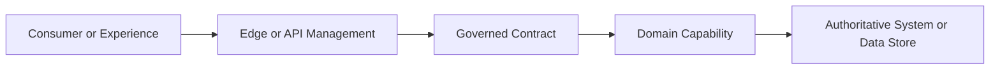
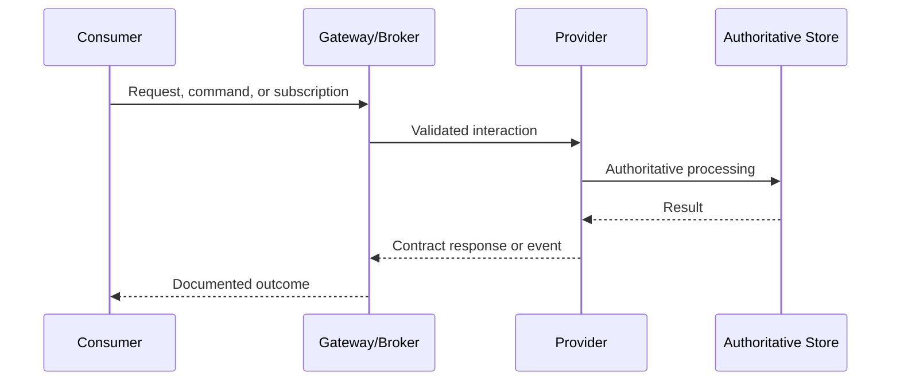

# Design Contract Template

> **Purpose:** Use this template to define and govern an API, event, schema, or other machine-consumable interface before or alongside consumer implementation. The completed contract should provide a stable, testable boundary between independently evolving providers and consumers.
>
> **Instructions:** Replace all text in angle brackets, such as `<Capability name>`. Delete sections that are genuinely not applicable, but record the reason as `Not applicable: <reason>`. Use normative terms consistently: **MUST**, **MUST NOT**, **SHOULD**, **SHOULD NOT**, and **MAY**.

---

## 1. Document Control

| Attribute | Value |
|---|---|
| Contract title | `<Contract title>` |
| Contract identifier | `<Unique identifier>` |
| Capability or domain | `<Business capability or bounded context>` |
| Interface type | `<Synchronous API / Event / Queue / Stream / Webhook / GraphQL / Schema / File exchange / Other>` |
| Specification format | `<OpenAPI / AsyncAPI / GraphQL SDL / JSON Schema / Avro / Protobuf / XSD / Other>` |
| Contract version | `<Semantic or approved version>` |
| Lifecycle state | `<Proposed / Draft / In review / Approved / Published / Deprecated / Retired>` |
| Classification | `<Public / Partner / Workforce / Internal / Service-to-service>` |
| Information classification | `<Classification and handling requirements>` |
| Business owner | `<Name or accountable role>` |
| Product or service owner | `<Name or accountable role>` |
| Technical owner | `<Name or accountable role>` |
| Security owner or reviewer | `<Name or accountable role>` |
| Operations owner | `<Name or accountable role>` |
| Repository location | `<Repository path>` |
| Machine-readable specification | `<Relative path or catalogue reference>` |
| Service catalogue entry | `<Catalogue identifier>` |
| Schema registry entry | `<Registry subject and identifier>` |
| Status | `<Status>` |
| Effective date | `<YYYY-MM-DD>` |
| Next review date | `<YYYY-MM-DD>` |
| Supersedes | `<Previous contract/version or Not applicable>` |

### 1.1 Revision History

| Version | Date | Author | Change summary | Compatibility impact | Approval reference |
|---|---|---|---|---|---|
| `<0.1>` | `<YYYY-MM-DD>` | `<Author>` | `<Initial draft>` | `<None>` | `<Reference>` |

### 1.2 Review and Approval

| Review area | Reviewer or authority | Required? | Decision | Date | Conditions or comments |
|---|---|---:|---|---|---|
| Business/domain | `<Role>` | Yes | `<Pending/Approved/Rejected>` | `<Date>` | `<Comments>` |
| Consumer representative | `<Role>` | Yes | `<Decision>` | `<Date>` | `<Comments>` |
| Architecture | `<Role>` | Yes | `<Decision>` | `<Date>` | `<Comments>` |
| Security | `<Role>` | `<Yes/No>` | `<Decision>` | `<Date>` | `<Comments>` |
| Privacy | `<Role>` | `<Yes/No>` | `<Decision>` | `<Date>` | `<Comments>` |
| Data governance | `<Role>` | `<Yes/No>` | `<Decision>` | `<Date>` | `<Comments>` |
| Operations/SRE | `<Role>` | Yes | `<Decision>` | `<Date>` | `<Comments>` |
| Legal/regulatory | `<Role>` | `<Yes/No>` | `<Decision>` | `<Date>` | `<Comments>` |

---

## 2. Executive Summary

### 2.1 Contract Intent

`<State what business capability this contract exposes, who consumes it, and the business outcome it enables.>`

### 2.2 Contract Boundary

**In scope**

- `<Operation, event, message, query, command, or data exchange>`
- `<Business behaviour covered>`

**Out of scope**

- `<Excluded business behaviour>`
- `<Internal implementation detail not exposed by this contract>`

### 2.3 Key Decisions

- `<Decision and rationale>`
- `<Important constraint or trade-off>`
- `<Approved exception, if any>`

### 2.4 Contract-First Readiness

| Criterion | Status | Evidence or action |
|---|---|---|
| Provider and consumers agree on business semantics | `<Red/Amber/Green>` | `<Evidence>` |
| Specification is machine-readable | `<R/A/G>` | `<Path>` |
| Examples and error behaviour are defined | `<R/A/G>` | `<Evidence>` |
| Security requirements are agreed | `<R/A/G>` | `<Evidence>` |
| Compatibility policy is agreed | `<R/A/G>` | `<Evidence>` |
| Mock or stub is available | `<R/A/G>` | `<Location>` |
| Contract tests are implemented | `<R/A/G>` | `<Pipeline/results>` |
| Operational expectations are agreed | `<R/A/G>` | `<Evidence>` |

---

## 3. Business and Domain Context

### 3.1 Business Capability

- **Capability:** `<Stable business capability>`
- **Domain/bounded context:** `<Domain>`
- **Business purpose:** `<Purpose>`
- **Authoritative owner:** `<Owner>`
- **Business process supported:** `<Process>`
- **Criticality:** `<Criticality and rationale>`

### 3.2 Business Outcomes

| Outcome | Measure | Baseline | Target | Owner |
|---|---|---|---|---|
| `<Outcome>` | `<Metric>` | `<Baseline>` | `<Target>` | `<Owner>` |

### 3.3 Business Rules

Document authoritative rules, not UI behaviour.

| Rule ID | Rule statement | Source/authority | Enforced by | Consumer visibility |
|---|---|---|---|---|
| `BR-001` | `<Rule>` | `<Policy/system/owner>` | `<Domain service>` | `<Returned result/error/event>` |

### 3.4 Glossary and Semantics

| Term | Authoritative definition | Valid values or notes | Source |
|---|---|---|---|
| `<Term>` | `<Unambiguous business meaning>` | `<Constraints>` | `<Authority>` |

### 3.5 Assumptions, Constraints, and Dependencies

**Assumptions**

- `<Assumption and validation owner>`

**Constraints**

- `<Regulatory, platform, operational, timing, or technology constraint>`

**Dependencies**

| Dependency | Owner | Purpose | Failure impact | Contract/SLA reference |
|---|---|---|---|---|
| `<Dependency>` | `<Owner>` | `<Purpose>` | `<Impact>` | `<Reference>` |

---

## 4. Stakeholders, Ownership, and Consumers

### 4.1 Responsibility Model

| Responsibility | Accountable | Responsible | Consulted | Informed |
|---|---|---|---|---|
| Business semantics | `<Role>` | `<Role>` | `<Roles>` | `<Roles>` |
| Contract design | `<Role>` | `<Role>` | `<Roles>` | `<Roles>` |
| Security and privacy | `<Role>` | `<Role>` | `<Roles>` | `<Roles>` |
| Implementation | `<Role>` | `<Role>` | `<Roles>` | `<Roles>` |
| Testing | `<Role>` | `<Role>` | `<Roles>` | `<Roles>` |
| Publication/catalogue | `<Role>` | `<Role>` | `<Roles>` | `<Roles>` |
| Operations and support | `<Role>` | `<Role>` | `<Roles>` | `<Roles>` |
| Versioning/deprecation | `<Role>` | `<Role>` | `<Roles>` | `<Roles>` |

### 4.2 Consumer Inventory

| Consumer | Owner | Channel/use case | Environment | Criticality | Release cadence | Contract version | Contact |
|---|---|---|---|---|---|---|---|
| `<Consumer>` | `<Owner>` | `<Use case>` | `<Env>` | `<Level>` | `<Cadence>` | `<Version>` | `<Contact>` |

### 4.3 Consumer Obligations

Consumers **MUST**:

- Use only documented contract behaviour.
- Validate and handle documented errors and processing states.
- Protect credentials, tokens, and returned data according to classification.
- Respect quotas, rate limits, pagination, and retry guidance.
- Implement idempotency and duplicate handling where required.
- Participate in migration from deprecated versions within the agreed window.
- Provide contact and dependency information for critical integrations.

Add contract-specific obligations:

- `<Obligation>`

### 4.4 Provider Obligations

The provider **MUST**:

- Preserve documented semantics and compatibility commitments.
- Enforce authoritative validation and authorization server-side.
- Publish accurate specifications, examples, lifecycle state, and support details.
- Monitor service quality and notify consumers of material incidents and changes.
- Follow the defined versioning, deprecation, and retirement process.

Add contract-specific obligations:

- `<Obligation>`

---

## 5. Contract Overview

### 5.1 Interaction Style

- **Pattern:** `<Request-response / Publish-subscribe / Command / Query / Webhook / Streaming / Batch>`
- **Direction:** `<Inbound / Outbound / Bidirectional>`
- **Protocol:** `<HTTPS / AMQP / Kafka / MQTT / WebSocket / SFTP / Other>`
- **Payload format:** `<JSON / Avro / Protobuf / XML / CSV / Other>`
- **Encoding:** `<UTF-8 or other>`
- **Schema dialect/version:** `<Version>`
- **Delivery expectation:** `<Synchronous result / At least once / At most once / Other>`
- **Consistency:** `<Strong / Eventual / Read-your-writes / Other>`

### 5.2 Context Diagram



Replace the diagram with the solution-specific channels, trust boundaries, providers, and authoritative data sources.

### 5.3 Sequence Overview



### 5.4 Interface Inventory

| Interface ID | Name | Type | Business purpose | Provider | Intended consumers | Specification reference |
|---|---|---|---|---|---|---|
| `INT-001` | `<Name>` | `<API/Event/etc.>` | `<Purpose>` | `<Provider>` | `<Consumers>` | `<Path>` |

---

## 6. Synchronous API Contract

> Complete this section for HTTP, REST, RPC, or other request-response interfaces. Otherwise state why it is not applicable.

### 6.1 Service Metadata

| Item | Definition |
|---|---|
| API title | `<Title>` |
| Base path | `</business-capability>` |
| Protocol/TLS requirement | `<Requirement>` |
| Specification version | `<OpenAPI or other version>` |
| API version | `<Version>` |
| Environments | `<Development/Test/Production endpoints through approved references>` |
| Media types | `<application/json, etc.>` |
| Character encoding | `<UTF-8>` |
| Time/date standard | `<ISO 8601 profile>` |
| Identifier conventions | `<UUID/opaque identifier/etc.>` |

### 6.2 Resource and Operation Catalogue

| Operation ID | Method | Path | Business intent | Authorization | Idempotent? | Success response | Key errors |
|---|---|---|---|---|---:|---|---|
| `<operationId>` | `<GET/POST/etc.>` | `</resource>` | `<Intent>` | `<Scope/policy>` | `<Yes/No>` | `<Code>` | `<Codes>` |

### 6.3 Operation Detail Template

Repeat this subsection for every operation.

#### `<Operation name>`

- **Operation ID:** `<Unique stable ID>`
- **Business intent:** `<Outcome, not screen action>`
- **Preconditions:** `<Conditions>`
- **Postconditions:** `<State after success>`
- **Authorization rule:** `<Resource/action boundary>`
- **Idempotency:** `<Requirement and key behaviour>`
- **Transactional boundary:** `<Boundary>`
- **Consistency expectation:** `<Expectation>`

**Request**

| Element | Location | Type | Required? | Constraints | Business meaning | Sensitive? |
|---|---|---|---:|---|---|---:|
| `<field>` | `<Path/Query/Header/Body>` | `<Type>` | `<Yes/No>` | `<Pattern/range>` | `<Meaning>` | `<Yes/No>` |

```json
{
  "exampleField": "<valid example>"
}
```

**Successful response**

| Status | Meaning | Schema | Headers | Cache behaviour |
|---|---|---|---|---|
| `<200/201/202/204>` | `<Meaning>` | `<Schema ref>` | `<Headers>` | `<Directive>` |

```json
{
  "result": "<example>"
}
```

**Error responses**

| Status/code | Error type | Meaning | Retriable? | Consumer action | Correlation available? |
|---|---|---|---:|---|---:|
| `<400>` | `<ValidationError>` | `<Meaning>` | No | `<Correct request>` | Yes |

```json
{
  "type": "<stable error type>",
  "title": "<safe title>",
  "status": 400,
  "code": "<stable business or technical code>",
  "detail": "<non-sensitive explanation>",
  "correlationId": "<identifier>",
  "errors": [
    {
      "field": "<field>",
      "code": "<validation code>",
      "message": "<safe message>"
    }
  ]
}
```

### 6.4 Query Behaviour

Define as applicable:

- **Filtering:** `<Allowed fields, operators, case sensitivity>`
- **Sorting:** `<Allowed fields and stable default order>`
- **Pagination:** `<Cursor/offset model, default and maximum page size>`
- **Field selection:** `<Sparse fieldsets or projections>`
- **Expansion:** `<Related resources that may be expanded>`
- **Search:** `<Semantics, matching, ranking, authorization filtering>`
- **Empty results:** `<Defined response>`
- **Maximum response size:** `<Limit>`

### 6.5 Concurrency and Conditional Requests

- **Concurrency model:** `<Optimistic/pessimistic/not applicable>`
- **Version token:** `<ETag/version field>`
- **Conditional headers:** `<If-Match/If-None-Match/etc.>`
- **Conflict behaviour:** `<Response and recovery>`

### 6.6 Long-Running Operations

- **Acceptance response:** `<e.g., 202 and status resource>`
- **Operation identifier:** `<Definition>`
- **Status states:** `<Pending/Running/Succeeded/Failed/Cancelled>`
- **Polling or callback model:** `<Definition>`
- **Expiry/retention:** `<Definition>`
- **Cancellation:** `<Supported behaviour>`
- **Final result retrieval:** `<Definition>`

---

## 7. Asynchronous Event and Messaging Contract

> Complete this section for events, queues, streams, commands, and asynchronous messages.

### 7.1 Channel and Broker Details

| Item | Definition |
|---|---|
| Event/message name | `<Past-tense event or imperative command>` |
| Business meaning | `<What occurred or is requested>` |
| Producer | `<Owning application/capability>` |
| Consumer groups | `<Known groups>` |
| Channel/topic/queue | `<Logical name>` |
| Protocol/binding | `<Kafka/AMQP/etc.>` |
| Partition key | `<Field and rationale>` |
| Ordering guarantee | `<Scope and limitation>` |
| Delivery semantics | `<At least once/etc.>` |
| Retention | `<Duration/policy>` |
| Replay support | `<Mechanism and constraints>` |
| Dead-letter handling | `<Location and ownership>` |
| Schema subject | `<Registry subject>` |

### 7.2 Event Semantics

- **Trigger:** `<Exact business occurrence>`
- **Emitted when:** `<Commit point and timing>`
- **Not emitted when:** `<Exclusions>`
- **Source of truth:** `<Authoritative capability>`
- **State representation:** `<Notification / State transfer / Delta>`
- **Processing expectation:** `<Consumer responsibility>`

### 7.3 Message Envelope

| Field | Type | Required? | Meaning | Constraints |
|---|---|---:|---|---|
| `messageId` | `<Type>` | Yes | Unique message identifier | `<Constraint>` |
| `eventType` | String | Yes | Stable event type | `<Naming rule>` |
| `eventVersion` | String | Yes | Schema/semantic version | `<Rule>` |
| `occurredAt` | Date-time | Yes | Business occurrence time | `<Format>` |
| `publishedAt` | Date-time | Yes | Publication time | `<Format>` |
| `source` | String | Yes | Producing capability | `<Allowed values>` |
| `correlationId` | String | Yes | End-to-end correlation | `<Rule>` |
| `causationId` | String | `<Yes/No>` | Causing message/operation | `<Rule>` |
| `subject` | String | Yes | Entity or aggregate identifier | `<Rule>` |
| `classification` | String | `<Yes/No>` | Handling classification | `<Allowed values>` |
| `data` | Object | Yes | Business payload | `<Schema ref>` |

```json
{
  "messageId": "<opaque-id>",
  "eventType": "<Domain.Entity.Event>",
  "eventVersion": "<version>",
  "occurredAt": "<timestamp>",
  "publishedAt": "<timestamp>",
  "source": "<capability>",
  "correlationId": "<correlation-id>",
  "causationId": "<causation-id>",
  "subject": "<entity-id>",
  "classification": "<classification>",
  "data": {}
}
```

### 7.4 Delivery, Duplication, Ordering, and Idempotency

- **Duplicate possibility:** `<Yes/No and circumstances>`
- **Consumer deduplication key:** `<messageId/business key>`
- **Deduplication retention:** `<Requirement>`
- **Ordering scope:** `<Per aggregate/partition/none>`
- **Out-of-order handling:** `<Consumer behaviour>`
- **Retry strategy:** `<Bounded policy>`
- **Poison message handling:** `<Policy>`
- **Acknowledgement semantics:** `<Policy>`
- **Reconciliation:** `<Process and owner>`

### 7.5 Schema Evolution

- **Compatibility mode:** `<Backward/forward/full/none>`
- **Optional field rules:** `<Rules>`
- **Field removal rules:** `<Rules>`
- **Type change rules:** `<Rules>`
- **Enum evolution rules:** `<Rules>`
- **Default values:** `<Rules>`
- **Unknown field handling:** `<Rules>`
- **Version coexistence:** `<Rules>`

---

## 8. Data and Schema Definition

### 8.1 Data Model

| Entity/object | Purpose | Authoritative source | Identifier | Ownership |
|---|---|---|---|---|
| `<Entity>` | `<Purpose>` | `<Source>` | `<ID>` | `<Owner>` |

### 8.2 Field-Level Dictionary

| Field | Path | Type/format | Required? | Nullable? | Cardinality | Definition | Allowed values | Validation | Classification | Example |
|---|---|---|---:|---:|---|---|---|---|---|---|
| `<Field>` | `<JSON path>` | `<Type>` | `<Y/N>` | `<Y/N>` | `<1..1>` | `<Meaning>` | `<Values>` | `<Rules>` | `<Class>` | `<Example>` |

### 8.3 Identifier Rules

- `<Define stability, uniqueness, opacity, case sensitivity, and reuse rules.>`
- `<State whether identifiers contain business meaning.>`
- `<Define cross-system mapping and canonical identifier policy.>`

### 8.4 Date, Time, Number, Currency, and Locale Rules

- **Date/time:** `<Format, timezone, precision, daylight-saving handling>`
- **Duration:** `<Format>`
- **Decimal precision:** `<Rule>`
- **Rounding:** `<Rule and authority>`
- **Currency:** `<ISO code handling and monetary representation>`
- **Units:** `<Explicit unit fields or conventions>`
- **Locale/language:** `<BCP 47 or approved representation>`
- **Character normalization:** `<Rule>`

### 8.5 Null, Missing, Empty, and Default Semantics

| Representation | Meaning | Allowed? | Processing rule |
|---|---|---:|---|
| Missing field | `<Meaning>` | `<Y/N>` | `<Rule>` |
| `null` | `<Meaning>` | `<Y/N>` | `<Rule>` |
| Empty string | `<Meaning>` | `<Y/N>` | `<Rule>` |
| Empty collection | `<Meaning>` | `<Y/N>` | `<Rule>` |
| Default value | `<Meaning>` | `<Y/N>` | `<Rule>` |

### 8.6 Enumerations and Code Sets

| Code set | Value | Meaning | Status | Effective dates | Unknown-value behaviour |
|---|---|---|---|---|---|
| `<Set>` | `<Value>` | `<Meaning>` | `<Active/Deprecated>` | `<Dates>` | `<Rule>` |

### 8.7 Data Quality Rules

| Rule ID | Rule | Severity | Enforcement point | Failure response | Owner |
|---|---|---|---|---|---|
| `DQ-001` | `<Rule>` | `<Error/Warning>` | `<Provider/Consumer>` | `<Behaviour>` | `<Owner>` |

### 8.8 Example Payload Set

Provide and validate examples for:

- Minimum valid payload
- Complete valid payload
- Each major business variant
- Boundary values
- Unicode and localization cases
- Empty collections and optional fields
- Invalid payloads for each error class
- Sensitive-data masking examples
- Previous and current compatible versions

---

## 9. Security, Privacy, and Trust

### 9.1 Trust Boundaries and Threat Context

- **Trust boundaries:** `<Describe or link diagram>`
- **Threat model reference:** `<Reference>`
- **Exposure:** `<Public/partner/workforce/internal/service>`
- **Abuse cases:** `<Enumeration, injection, replay, scraping, resource exhaustion, etc.>`

### 9.2 Authentication

| Actor/workload | Identity provider | Protocol | Credential/token type | Audience | Lifetime | Rotation |
|---|---|---|---|---|---|---|
| `<Actor>` | `<IdP>` | `<OAuth/OIDC/mTLS/etc.>` | `<Type>` | `<Audience>` | `<Lifetime>` | `<Policy>` |

### 9.3 Authorization

- **Authorization model:** `<RBAC/ABAC/ReBAC/policy/resource-based>`
- **Protected resource:** `<Resource>`
- **Actions:** `<Read/create/update/etc.>`
- **Scopes/roles/claims:** `<Definitions>`
- **Object-level authorization:** `<Rule>`
- **Field-level authorization:** `<Rule>`
- **Tenant/organisation isolation:** `<Rule>`
- **Decision owner:** `<Service/policy decision point>`
- **Deny behaviour:** `<Safe response>`

### 9.4 Transport and Message Protection

- **Transport encryption:** `<Requirement>`
- **Mutual authentication:** `<Requirement>`
- **Message signing:** `<Requirement>`
- **Payload encryption:** `<Requirement>`
- **Certificate/key management:** `<Owner and policy>`
- **Replay prevention:** `<Nonce/timestamp/idempotency policy>`

### 9.5 Input and Output Protection

- Schema validation and payload-size limits: `<Rules>`
- Injection protection: `<Rules>`
- File/content validation: `<Rules>`
- Output encoding: `<Rules>`
- Sensitive error handling: `<Rules>`
- Mass-assignment protection: `<Rules>`
- SSRF and unsafe callback protection: `<Rules>`

### 9.6 Privacy and Data Handling

| Data element/category | Classification | Purpose | Lawful/approved basis | Minimisation | Retention | Residency | Access/logging restriction |
|---|---|---|---|---|---|---|---|
| `<Data>` | `<Class>` | `<Purpose>` | `<Basis>` | `<Rule>` | `<Period>` | `<Location>` | `<Rule>` |

Document:

- Consent or preference requirements: `<Requirement>`
- Data subject rights handling: `<Requirement>`
- Cross-border restrictions: `<Requirement>`
- Derived stores/caches/search indexes: `<Controls>`
- Deletion and propagation: `<Process>`
- Privacy assessment reference: `<Reference>`

### 9.7 Secrets and Credentials

- Secrets **MUST NOT** appear in specifications, examples, source code, URLs, logs, or client-side applications.
- Secret store: `<Approved store>`
- Rotation and expiry: `<Policy>`
- Break-glass access: `<Control>`
- Credential compromise response: `<Runbook>`

---

## 10. Error and Outcome Model

### 10.1 Error Taxonomy

| Category | Stable code range/prefix | Examples | Retriable? | Owner |
|---|---|---|---:|---|
| Validation | `<Prefix>` | `<Examples>` | No | `<Owner>` |
| Authentication | `<Prefix>` | `<Examples>` | No | `<Owner>` |
| Authorization | `<Prefix>` | `<Examples>` | No | `<Owner>` |
| Business rejection | `<Prefix>` | `<Examples>` | Usually no | `<Owner>` |
| Conflict/concurrency | `<Prefix>` | `<Examples>` | Conditional | `<Owner>` |
| Rate/capacity | `<Prefix>` | `<Examples>` | Yes, bounded | `<Owner>` |
| Dependency failure | `<Prefix>` | `<Examples>` | Conditional | `<Owner>` |
| Internal failure | `<Prefix>` | `<Examples>` | Conditional | `<Owner>` |

### 10.2 Error Design Rules

- Error codes **MUST** be stable and machine-actionable.
- Messages **MUST NOT** expose secrets, stack traces, database details, or sensitive data.
- Technical failure **MUST** be distinguishable from business rejection.
- Retriable errors **MUST** identify safe retry conditions where appropriate.
- Correlation identifiers **MUST** be returned or propagated where feasible.
- Consumers **MUST NOT** parse human-readable text to determine program behaviour.

### 10.3 Partial, Pending, and Failed States

| State | Meaning | Consumer display/action | Recovery | Finality |
|---|---|---|---|---|
| `<Pending>` | `<Meaning>` | `<Action>` | `<Recovery>` | `<Final/Non-final>` |

---

## 11. Service Quality and Non-Functional Contract

### 11.1 Service Objectives

| Indicator | Definition | Target/objective | Measurement point | Window | Owner |
|---|---|---|---|---|---|
| Availability | `<Definition>` | `<Target>` | `<Point>` | `<Window>` | `<Owner>` |
| Latency | `<Percentile and operation>` | `<Target>` | `<Point>` | `<Window>` | `<Owner>` |
| Throughput | `<Definition>` | `<Target>` | `<Point>` | `<Window>` | `<Owner>` |
| Error rate | `<Definition>` | `<Target>` | `<Point>` | `<Window>` | `<Owner>` |
| Freshness | `<Definition>` | `<Target>` | `<Point>` | `<Window>` | `<Owner>` |
| Durability | `<Definition>` | `<Target>` | `<Point>` | `<Window>` | `<Owner>` |

### 11.2 Capacity and Limits

| Limit | Value | Scope | Exceed behaviour | Change process |
|---|---|---|---|---|
| Request size | `<Value>` | `<Scope>` | `<Response>` | `<Process>` |
| Response size | `<Value>` | `<Scope>` | `<Response>` | `<Process>` |
| Rate limit | `<Value>` | `<Identity/tenant/etc.>` | `<429/back-pressure>` | `<Process>` |
| Concurrency | `<Value>` | `<Scope>` | `<Behaviour>` | `<Process>` |
| Page size | `<Default/max>` | `<Operation>` | `<Behaviour>` | `<Process>` |
| Message size | `<Value>` | `<Channel>` | `<Behaviour>` | `<Process>` |

### 11.3 Performance Budget

- End-to-end journey budget: `<Budget>`
- Contract/provider allocation: `<Budget>`
- Dependency allocation: `<Budget>`
- Serialization/network allocation: `<Budget>`
- Test workload and data profile: `<Profile>`

### 11.4 Maintenance and Support Windows

- Support hours: `<Definition>`
- Planned maintenance: `<Policy>`
- Notification period: `<Policy>`
- Freeze/blackout periods: `<Policy>`
- Emergency change process: `<Reference>`

---

## 12. Resilience and Failure Behaviour

### 12.1 Timeout, Retry, and Circuit-Breaking Policy

| Interaction | Timeout | Retry count | Backoff/jitter | Safe methods/messages | Circuit-breaker behaviour |
|---|---|---|---|---|---|
| `<Dependency>` | `<Value>` | `<Bounded count>` | `<Policy>` | `<Scope>` | `<Policy>` |

### 12.2 Failure Mode Analysis

| Failure mode | Detection | Contract behaviour | Consumer behaviour | Recovery/reconciliation | Owner |
|---|---|---|---|---|---|
| Provider unavailable | `<Signal>` | `<Error/degraded response>` | `<Action>` | `<Process>` | `<Owner>` |
| Dependency unavailable | `<Signal>` | `<Behaviour>` | `<Action>` | `<Process>` | `<Owner>` |
| Timeout | `<Signal>` | `<Behaviour>` | `<Action>` | `<Process>` | `<Owner>` |
| Duplicate message | `<Signal>` | `<Behaviour>` | `<Action>` | `<Process>` | `<Owner>` |
| Out-of-order event | `<Signal>` | `<Behaviour>` | `<Action>` | `<Process>` | `<Owner>` |
| Schema incompatibility | `<Signal>` | `<Behaviour>` | `<Action>` | `<Process>` | `<Owner>` |
| Capacity exceeded | `<Signal>` | `<Behaviour>` | `<Action>` | `<Process>` | `<Owner>` |

### 12.3 Graceful Degradation

- Critical data/functionality: `<Must remain available>`
- Non-critical data/functionality: `<May be omitted/deferred>`
- Fallback source/cache: `<Definition>`
- Maximum acceptable staleness: `<Value>`
- User-visible state: `<Required wording/behaviour>`
- False-success prevention: `<Control>`

### 12.4 Continuity and Recovery

- Recovery time objective: `<RTO>`
- Recovery point objective: `<RPO>`
- Backup/restore scope: `<Scope>`
- Regional/site failover: `<Design>`
- Replay/rebuild procedure: `<Procedure>`
- Reconciliation owner: `<Owner>`
- Recovery test frequency: `<Frequency>`

---

## 13. Observability and Audit Contract

### 13.1 Correlation and Trace Context

- Correlation identifier format: `<Format>`
- Trace context standard: `<Standard>`
- Propagation across async boundaries: `<Method>`
- Consumer-supplied IDs: `<Validation/trust rule>`
- Support search key: `<Safe identifier>`

### 13.2 Required Telemetry

| Signal | Required fields | Collection point | Retention | Access | Owner |
|---|---|---|---|---|---|
| Logs | `<Fields>` | `<Point>` | `<Period>` | `<Roles>` | `<Owner>` |
| Metrics | `<Metrics>` | `<Point>` | `<Period>` | `<Roles>` | `<Owner>` |
| Traces | `<Spans/attributes>` | `<Point>` | `<Period>` | `<Roles>` | `<Owner>` |
| Audit records | `<Events>` | `<Point>` | `<Period>` | `<Roles>` | `<Owner>` |

### 13.3 Logging Restrictions

The following **MUST NOT** be logged unless explicitly approved and protected:

- Access or refresh tokens
- Passwords, API keys, private keys, or secrets
- Unmasked sensitive payloads
- Unnecessary personal information
- Full payment or credential data
- Internal security details exposed to consumers

Contract-specific restrictions:

- `<Restriction>`

### 13.4 Alerts and Operational Dashboards

| Condition | Threshold | Severity | Alert owner | Response/runbook |
|---|---|---|---|---|
| `<Condition>` | `<Threshold>` | `<Severity>` | `<Owner>` | `<Reference>` |

### 13.5 Audit Requirements

- Audited actions: `<Create/update/delete/access/approval/etc.>`
- Actor identity: `<Required representation>`
- Before/after values: `<Allowed/required>`
- Business reason: `<Requirement>`
- Tamper protection: `<Control>`
- Retention: `<Requirement>`
- Audit retrieval: `<Process>`

---

## 14. Compatibility, Versioning, and Lifecycle

### 14.1 Versioning Strategy

- **Version scheme:** `<Semantic/date/major only/etc.>`
- **Version location:** `<Path/header/media type/schema metadata>`
- **Compatibility definition:** `<What consumers may rely upon>`
- **Supported versions:** `<Versions>`
- **Parallel-version policy:** `<Policy>`

### 14.2 Change Classification

| Change type | Example | Compatibility | Required action |
|---|---|---|---|
| Additive optional field | Add optional response property | Usually compatible subject to consumer rules | Update spec/tests; notify as required |
| Add operation/event | New independent capability | Usually compatible | Review and publish |
| Tighten validation | Reduce accepted values | Potentially breaking | Impact assessment/versioning |
| Remove/rename field | Delete or rename property | Breaking | New version/migration |
| Change field meaning | Same field, new semantics | Breaking | New version/migration |
| Change type/cardinality | String to number, one to many | Breaking | New version/migration |
| Add enum value | New valid code | `<Define policy>` | `<Action>` |
| Change error behaviour | New status/code semantics | Potentially breaking | Assess and test |
| Change security requirement | New scope/auth mechanism | Potentially breaking | Migration and approval |
| Change SLO/limit | Lower quota or availability | Potentially breaking | Consumer consultation |

### 14.3 Compatibility Rules

Consumers **MUST**:

- Ignore unknown response/event fields unless prohibited by the selected encoding.
- Avoid depending on field order.
- Depend only on documented semantics.
- Handle documented optionality and unknown enum policy.

Providers **MUST**:

- Prefer additive compatible changes.
- Avoid silent changes to field meaning.
- Test known consumers or consumer contracts before release.
- Publish breaking changes under the approved versioning approach.

Add format-specific compatibility rules:

- `<Rule>`

### 14.4 Deprecation and Retirement

| Milestone | Date or trigger | Owner | Consumer communication | Exit criteria |
|---|---|---|---|---|
| Deprecation announced | `<Date/trigger>` | `<Owner>` | `<Method>` | `<Criteria>` |
| Replacement available | `<Date/trigger>` | `<Owner>` | `<Method>` | `<Criteria>` |
| Migration complete | `<Date/trigger>` | `<Owner>` | `<Method>` | `<Criteria>` |
| Traffic disabled | `<Date/trigger>` | `<Owner>` | `<Method>` | `<Criteria>` |
| Contract retired | `<Date/trigger>` | `<Owner>` | `<Method>` | `<Criteria>` |

### 14.5 Consumer Migration Plan

| Consumer | Current version | Target version | Owner | Test status | Migration status | Risk/blocker |
|---|---|---|---|---|---|---|
| `<Consumer>` | `<Version>` | `<Version>` | `<Owner>` | `<Status>` | `<Status>` | `<Risk>` |

---

## 15. Testing and Assurance

### 15.1 Test Strategy

| Test type | Scope | Provider responsibility | Consumer responsibility | Automation | Evidence |
|---|---|---|---|---:|---|
| Specification linting | Syntax/style/governance | Yes | As applicable | Yes | `<Pipeline>` |
| Schema validation | Examples and payloads | Yes | Yes | Yes | `<Evidence>` |
| Provider contract tests | Implementation conforms | Yes | No | Yes | `<Evidence>` |
| Consumer contract tests | Consumer expectations | Support/publish | Yes | Yes | `<Evidence>` |
| Integration tests | Boundaries/dependencies | Shared | Shared | Yes | `<Evidence>` |
| Negative tests | Errors/security/limits | Yes | Yes | Yes | `<Evidence>` |
| Compatibility tests | Previous/current versions | Yes | Participate | Yes | `<Evidence>` |
| Performance tests | SLOs and limits | Yes | Workload input | Yes | `<Evidence>` |
| Resilience tests | Failure/recovery | Yes | As applicable | `<Y/N>` | `<Evidence>` |
| Security tests | Threats and controls | Yes | As applicable | `<Y/N>` | `<Evidence>` |
| Privacy tests | Minimisation/masking | Yes | Yes | `<Y/N>` | `<Evidence>` |

### 15.2 Contract Test Cases

| Test ID | Requirement | Given | When | Then | Automated? | Result |
|---|---|---|---|---|---:|---|
| `CT-001` | `<Requirement>` | `<Precondition>` | `<Action>` | `<Expected>` | Yes | `<Status>` |

### 15.3 Quality Gates

A release **MUST NOT** proceed unless:

- The machine-readable specification passes syntax and policy validation.
- All examples validate against the declared schemas.
- Provider contract tests pass.
- Critical consumer contract tests pass or an approved exception exists.
- Breaking-change detection passes or the change follows the approved version process.
- Security and privacy checks appropriate to risk pass.
- Performance and resilience evidence meets agreed requirements.
- The catalogue and documentation are current.

### 15.4 Test Data

- Synthetic data policy: `<Policy>`
- Production data restrictions: `<Rules>`
- Masking/tokenisation: `<Rules>`
- Edge and boundary cases: `<Definition>`
- Test data owner: `<Owner>`
- Retention/deletion: `<Policy>`

---

## 16. Delivery, Publication, and Environments

### 16.1 Source and Repository Structure

```text
/contracts/<capability>/<contract-name>/
  README.md
  openapi.yaml | asyncapi.yaml | schema.graphql | schema.json
  examples/
  schemas/
  tests/
  changelog.md
  migration/
```

Adapt to the approved repository standard.

### 16.2 Build and Publication Pipeline

```mermaid
flowchart LR
    Commit[Contract change] --> Lint[Lint and policy checks]
    Lint --> Validate[Schema and example validation]
    Validate --> Diff[Compatibility and breaking-change check]
    Diff --> Tests[Provider and consumer contract tests]
    Tests --> Review[Required approvals]
    Review --> Publish[Catalogue/registry/documentation publication]
    Publish --> Deploy[Implementation deployment]
```



### 16.3 Environment Matrix

| Environment | Purpose | Endpoint/channel reference | Data classification | Access | Version | Owner |
|---|---|---|---|---|---|---|
| Development | `<Purpose>` | `<Reference>` | `<Class>` | `<Control>` | `<Version>` | `<Owner>` |
| Test | `<Purpose>` | `<Reference>` | `<Class>` | `<Control>` | `<Version>` | `<Owner>` |
| Production | `<Purpose>` | `<Reference>` | `<Class>` | `<Control>` | `<Version>` | `<Owner>` |

### 16.4 Mock, Stub, and Sandbox

- Location: `<Reference>`
- Generated from contract?: `<Yes/No>`
- Supported scenarios: `<List>`
- State/data behaviour: `<Definition>`
- Authentication: `<Definition>`
- Limitations: `<List>`
- Owner and support: `<Owner>`

### 16.5 Configuration

- Configuration ownership: `<Owner>`
- Environment differences: `<Documented values>`
- Feature controls: `<Flags/policy>`
- Secrets injection: `<Method>`
- Reproducibility: `<Infrastructure/configuration as code>`

---

## 17. Operations and Support

### 17.1 Support Model

| Area | Owner/team | Contact/channel | Hours | Escalation |
|---|---|---|---|---|
| Business questions | `<Owner>` | `<Contact>` | `<Hours>` | `<Path>` |
| Technical integration | `<Owner>` | `<Contact>` | `<Hours>` | `<Path>` |
| Production incident | `<Owner>` | `<Contact>` | `<Hours>` | `<Path>` |
| Security incident | `<Owner>` | `<Contact>` | `<Hours>` | `<Path>` |
| Data/privacy incident | `<Owner>` | `<Contact>` | `<Hours>` | `<Path>` |

### 17.2 Operational Runbooks

| Scenario | Runbook | Owner | Last tested |
|---|---|---|---|
| Service outage | `<Reference>` | `<Owner>` | `<Date>` |
| Message backlog | `<Reference>` | `<Owner>` | `<Date>` |
| Replay/reconciliation | `<Reference>` | `<Owner>` | `<Date>` |
| Certificate/secret rotation | `<Reference>` | `<Owner>` | `<Date>` |
| Consumer onboarding | `<Reference>` | `<Owner>` | `<Date>` |
| Incident data extraction | `<Reference>` | `<Owner>` | `<Date>` |

### 17.3 Incident and Problem Management

- Incident severity mapping: `<Reference>`
- Consumer notification method: `<Method>`
- Status communication: `<Method>`
- Root-cause analysis threshold: `<Policy>`
- Problem backlog owner: `<Owner>`
- Contract correction process: `<Process>`

---

## 18. Consumer Onboarding and Offboarding

### 18.1 Onboarding Checklist

- [ ] Consumer and owner recorded in the inventory.
- [ ] Business purpose and permitted use approved.
- [ ] Data classification and privacy requirements accepted.
- [ ] Identity and authorization configured.
- [ ] Quotas and service objectives agreed.
- [ ] Specification, examples, mock, and test environment provided.
- [ ] Consumer contract tests implemented for critical expectations.
- [ ] Operational and escalation contacts exchanged.
- [ ] Production readiness review completed.
- [ ] Catalogue dependency recorded.

### 18.2 Offboarding Checklist

- [ ] Consumer confirms traffic has ceased.
- [ ] Credentials, subscriptions, and permissions revoked.
- [ ] Consumer-specific routing or configuration removed.
- [ ] Data retention/deletion obligations completed.
- [ ] Dependency inventory and catalogue updated.
- [ ] Monitoring confirms no residual usage.
- [ ] Lessons and issues captured.

---

## 19. Risks, Decisions, and Exceptions

### 19.1 Risk Register

| Risk ID | Risk | Cause | Impact | Likelihood | Rating | Mitigation/control | Owner | Due/review date | Status |
|---|---|---|---|---|---|---|---|---|---|
| `R-001` | `<Risk>` | `<Cause>` | `<Impact>` | `<Level>` | `<Rating>` | `<Control>` | `<Owner>` | `<Date>` | `<Status>` |

### 19.2 Architecture Decisions

| ADR | Decision | Options considered | Rationale | Consequences | Owner/date |
|---|---|---|---|---|---|
| `<ADR-001>` | `<Decision>` | `<Options>` | `<Rationale>` | `<Consequences>` | `<Owner/date>` |

### 19.3 Exceptions

| Exception ID | Requirement deviated from | Rationale | Risk | Compensating controls | Approver | Expiry/review | Remediation/exit |
|---|---|---|---|---|---|---|---|
| `<EX-001>` | `<Requirement>` | `<Reason>` | `<Risk>` | `<Controls>` | `<Authority>` | `<Date>` | `<Plan>` |

---

## 20. Traceability Matrix

Map contract requirements to implementation and evidence.

| Requirement ID | Requirement | Specification location | Implementation | Test evidence | Operational evidence | Owner |
|---|---|---|---|---|---|---|
| `REQ-001` | `<Requirement>` | `<Section/path>` | `<Component>` | `<Test>` | `<Dashboard/runbook>` | `<Owner>` |

---

## 21. Conformance Checklist

### Contract Definition

- [ ] Business capability, domain, and authoritative owner are explicit.
- [ ] Contract scope and exclusions are clear.
- [ ] Business terms and field semantics are unambiguous.
- [ ] The contract exposes business intent rather than screens, widgets, or database structures.
- [ ] The specification is machine-readable and version controlled.
- [ ] Each operation, event, command, or query has a stable identifier and purpose.
- [ ] Inputs, outputs, errors, and examples are defined.
- [ ] Optionality, nullability, defaults, enumerations, and precision are defined.

### Consumers and Ownership

- [ ] Known consumers and owners are recorded.
- [ ] Provider and consumer obligations are explicit.
- [ ] Support, funding, lifecycle, and retirement ownership are assigned.
- [ ] Intended consumers participated in contract review.

### Security and Privacy

- [ ] Authentication and authorization are defined at the protected resource/action boundary.
- [ ] Workload identities and secrets use approved controls.
- [ ] Input, payload, and resource-consumption controls are defined.
- [ ] Data classification, minimisation, retention, residency, and deletion are addressed.
- [ ] Logs, traces, examples, and errors avoid unnecessary sensitive information.
- [ ] Threat and privacy assessments are complete according to risk.

### Reliability and Performance

- [ ] Timeouts, bounded retries, idempotency, and duplicate handling are defined.
- [ ] Partial, pending, failed, and degraded states are explicit.
- [ ] Capacity, quotas, pagination, payload limits, and back-pressure are defined.
- [ ] Service objectives and measurement points are agreed.
- [ ] Recovery, replay, reconciliation, and continuity responsibilities are assigned.

### Compatibility and Lifecycle

- [ ] Versioning and compatibility rules are explicit.
- [ ] Breaking-change detection is automated where practical.
- [ ] Deprecation, migration, and retirement processes are defined.
- [ ] Usage can be measured before retirement.
- [ ] Schema evolution rules cover types, fields, enumerations, and defaults.

### Testing and Delivery

- [ ] Mock services or stubs are available where parallel delivery requires them.
- [ ] Provider and consumer contract tests protect critical expectations.
- [ ] Valid, invalid, boundary, and compatibility examples are tested.
- [ ] Specification and schema validation run in the delivery pipeline.
- [ ] Security, resilience, performance, and privacy testing are proportionate to risk.
- [ ] Publication to the approved catalogue/registry is automated or controlled.

### Operations

- [ ] Logs, metrics, traces, correlation, and audit requirements are defined.
- [ ] Dashboards and alerts are actionable and owned.
- [ ] Support routes, escalation, and runbooks are published.
- [ ] Incident notification and consumer communication are defined.

---

## 22. Definition of Ready

The contract is ready for provider and consumer implementation when:

- [ ] Business intent, domain ownership, and authoritative semantics are approved.
- [ ] Consumers agree that the contract supports their use cases without embedding channel-specific business logic.
- [ ] A reviewable machine-readable specification exists.
- [ ] Security, privacy, data, and operational requirements are identified.
- [ ] Error, idempotency, compatibility, and lifecycle rules are agreed.
- [ ] Representative valid and invalid examples pass schema validation.
- [ ] Mock/stub access supports parallel development where required.
- [ ] Open decisions and exceptions have owners and due/review dates.

## 23. Definition of Done

The contract is ready for production publication when:

- [ ] All required approvals are recorded.
- [ ] Provider implementation conforms to the published specification.
- [ ] Critical consumer contract tests pass.
- [ ] Breaking-change and compatibility checks pass.
- [ ] Security, privacy, performance, and resilience evidence is accepted.
- [ ] Monitoring, tracing, auditing, alerts, and runbooks are operational.
- [ ] Catalogue/registry entries, examples, changelog, and support details are current.
- [ ] Consumer onboarding and production-readiness activities are complete.
- [ ] Rollback, roll-forward, reconciliation, and incident procedures are tested.

---

## 24. Appendices

### Appendix A: Machine-Readable Specification Skeletons

#### A.1 OpenAPI Skeleton

```yaml
openapi: 3.1.0
info:
  title: <API title>
  version: <API version>
  description: <Business capability and contract purpose>
servers:
  - url: <approved environment reference>
tags:
  - name: <business resource/capability>
paths:
  /<resources>:
    get:
      operationId: <stableOperationId>
      summary: <Business intent>
      security:
        - oauth2: [<scope>]
      responses:
        '200':
          description: <Successful outcome>
          content:
            application/json:
              schema:
                $ref: '#/components/schemas/<Response>'
        '400':
          $ref: '#/components/responses/BadRequest'
components:
  schemas:
    <Response>:
      type: object
      additionalProperties: false
      required: [<field>]
      properties:
        <field>:
          type: string
          description: <Authoritative business meaning>
  responses:
    BadRequest:
      description: <Validation failure>
  securitySchemes:
    oauth2:
      type: oauth2
      flows:
        <approved-flow>: {}
```

#### A.2 AsyncAPI Skeleton

```yaml
asyncapi: 3.0.0
info:
  title: <Application or capability event contract>
  version: <Contract version>
  description: <Business purpose>
channels:
  <channelId>:
    address: <logical-channel-name>
    messages:
      <messageId>:
        $ref: '#/components/messages/<MessageName>'
operations:
  <operationId>:
    action: send
    channel:
      $ref: '#/channels/<channelId>'
components:
  messages:
    <MessageName>:
      name: <Stable message name>
      title: <Human-readable title>
      summary: <Exact business occurrence>
      payload:
        $ref: '#/components/schemas/<Payload>'
  schemas:
    <Payload>:
      type: object
      required: [<field>]
      properties:
        <field>:
          type: string
          description: <Authoritative business meaning>
```

#### A.3 JSON Schema Skeleton

```json
{
  "$schema": "https://json-schema.org/draft/2020-12/schema",
  "$id": "<stable-schema-identifier>",
  "title": "<Schema title>",
  "description": "<Business purpose and semantics>",
  "type": "object",
  "additionalProperties": false,
  "required": ["<field>"],
  "properties": {
    "<field>": {
      "type": "string",
      "description": "<Authoritative business meaning>"
    }
  }
}
```

### Appendix B: Consumer-Driven Contract Scenario

```gherkin
Feature: <Capability contract>

  Scenario: <Successful business outcome>
    Given <valid precondition>
    When the consumer <invokes operation or processes event>
    Then the provider returns or publishes <documented outcome>
    And the payload conforms to <schema and version>

  Scenario: <Documented rejection>
    Given <invalid or disallowed condition>
    When the consumer <performs action>
    Then the provider returns <stable error code>
    And no unauthorized state change occurs
```

### Appendix C: Breaking-Change Review Record

| Question | Response | Evidence |
|---|---|---|
| Does the change remove or rename anything? | `<Yes/No>` | `<Evidence>` |
| Does it alter meaning, type, requiredness, cardinality, or validation? | `<Yes/No>` | `<Evidence>` |
| Does it add an enum value consumers may reject? | `<Yes/No>` | `<Evidence>` |
| Does it alter authentication, authorization, rate limits, or SLOs? | `<Yes/No>` | `<Evidence>` |
| Does it change ordering, delivery, idempotency, or retry behaviour? | `<Yes/No>` | `<Evidence>` |
| Have known consumers and consumer contract tests been assessed? | `<Yes/No>` | `<Evidence>` |
| Is a new version or migration required? | `<Yes/No>` | `<Decision>` |

### Appendix D: Suggested Contract Review Agenda

1. Business purpose, scope, and authoritative semantics
2. Consumer use cases and channel neutrality
3. Operations/events and schema walkthrough
4. Errors, state transitions, idempotency, and consistency
5. Security, privacy, classification, and trust boundaries
6. Performance, limits, resilience, and recovery
7. Compatibility, versioning, migration, and retirement
8. Testing, mocks, publication, and delivery gates
9. Operations, telemetry, support, and ownership
10. Decisions, risks, exceptions, and approval actions

### Appendix E: Reference Standards

Use the versions approved by the organisation and record the selected version in Document Control.

- [OpenAPI Specification](https://spec.openapis.org/oas/latest.html)
- [AsyncAPI Specification](https://www.asyncapi.com/docs/reference/specification/latest)
- [JSON Schema Specification](https://json-schema.org/specification)
- [GraphQL Specification](https://spec.graphql.org/)
- [RFC 2119: Key words for use in RFCs](https://www.rfc-editor.org/rfc/rfc2119)
- [RFC 8174: Ambiguity of Uppercase vs Lowercase in RFC 2119 Key Words](https://www.rfc-editor.org/rfc/rfc8174)

---

## 25. Final Approval Statement

By approving this contract, the provider and identified consumers agree that:

1. The contract accurately represents the intended business semantics and supported behaviours.
2. Implementations will conform to the published machine-readable specification.
3. Undocumented behaviour will not be treated as a supported dependency.
4. Security, privacy, service quality, compatibility, and operational obligations will be maintained through the contract lifecycle.
5. Material or breaking changes will follow the agreed review, versioning, migration, and retirement process.

| Role | Name | Decision | Date | Signature/reference |
|---|---|---|---|---|
| Business owner | `<Name>` | `<Approved/Rejected>` | `<Date>` | `<Reference>` |
| Product/service owner | `<Name>` | `<Decision>` | `<Date>` | `<Reference>` |
| Technical owner | `<Name>` | `<Decision>` | `<Date>` | `<Reference>` |
| Consumer representative | `<Name>` | `<Decision>` | `<Date>` | `<Reference>` |
| Architecture authority | `<Name>` | `<Decision>` | `<Date>` | `<Reference>` |
| Security/privacy authority | `<Name>` | `<Decision>` | `<Date>` | `<Reference>` |
